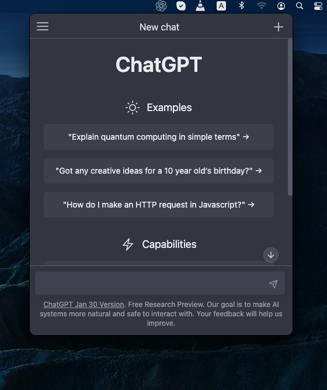

# openai-chatgpt-desktop

A sample app that enables user to conveniently access [OpenAI ChatGPT](https://openai.com/blog/chatgpt/) from their desktop menubar.



---

This is my first [Electron desktop app](https://www.electronjs.org/docs/latest/). I was inspired by [chatgpt-mac](https://github.com/vincelwt/chatgpt-mac) and so I wanted to make my own.


# Reuse

You can change the `src` URL of the `webview` component in `index.html` if you want to reuse this for some other website.

```html
<div class="container">
    <webview src="https://some-other-website.com" autosize="on" ></webview>
</div>
```

# Disclaimer

I have only tested this using Mac desktop although [menubar](https://github.com/maxogden/menubar) supposedly can also work with Windows and Linux.


# Setup

Clone the repository and install the dependencies

```sh
$ git clone https://github.com/supershaneski/openai-chatgpt-desktop.git myproject

$ cd myproject

$ npm install
```

Then run the app

```sh
$ npm run start
```

Check your desktop's menubar and click the newly added icon to launch the app


## Credits

All credits, icon and copyrights goes to OpenAI